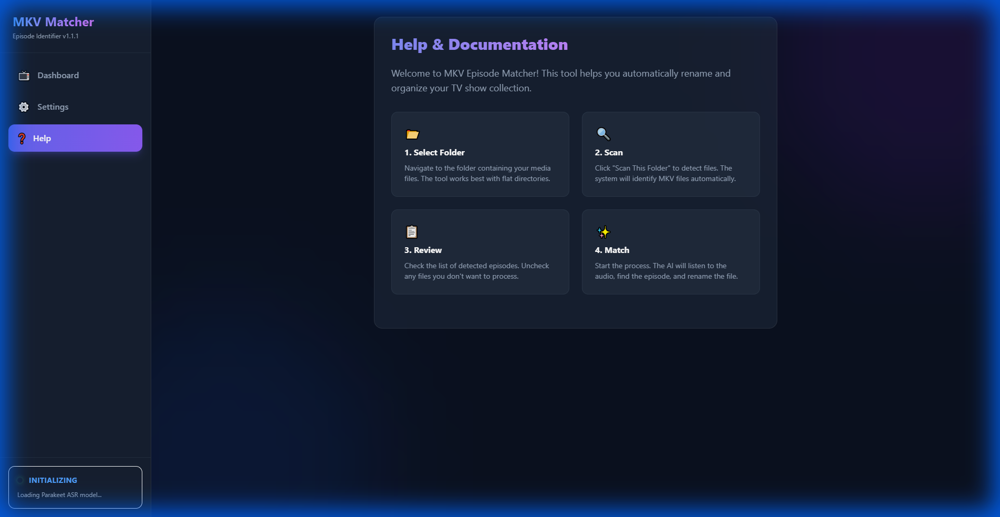

# Quick Start Guide

Get started with MKV Episode Matcher quickly and efficiently.

## 🚀 Launch the Web UI

The easiest way to get started is with the Web UI:

```bash
# Launch the web interface (opens http://localhost:8001)
mkv-match serve

# Or use the gui alias
mkv-match gui
```

The Web UI will automatically open in your browser after the server starts.

> [!NOTE]
> First run takes **~60 seconds** to load the NVIDIA Parakeet ASR model. Subsequent runs are much faster.

### 📸 Web UI Onboarding

**Dashboard - Select Your Media Folder**


**Settings - Configure API Keys**


**Help - 4-Step Workflow Guide**


### First Time Setup

1. **Start the server**: Run `mkv-match serve`
2. **Configure settings**: Click Settings in the sidebar and add your API keys:
   - **OpenSubtitles**: For automatic subtitle downloads (optional but recommended)
   - **TMDb API Key**: For episode title information (optional)
3. **Select a folder**: Navigate to your TV show folder on the Dashboard
4. **Scan and match**: Click "Scan This Folder" to find and rename your episodes


### 💻 Command Line Interface

For automation and advanced users:

#### 1. Configuration Setup
```bash
# Interactive configuration wizard
mkv-match config

# Set specific configuration values
mkv-match config --tmdb-api-key "your_key" --opensub-api-key "your_key"
```

#### 2. Basic Matching
```bash
# Process a single MKV file
mkv-match match "/path/to/episode.mkv"

# Process an entire series folder
mkv-match match "/path/to/Show/Season 1/"

# Process entire library with subtitle downloads
mkv-match match "/path/to/library/" --get-subs
```

#### 3. Advanced Options
```bash
# Dry run with specific season
mkv-match match "/path/to/show/" --season 1 --dry-run

# JSON output for automation
mkv-match match "/path/to/show/" --json

# Copy files instead of renaming
mkv-match match "/path/to/show/" --output-dir "/path/to/renamed/"
```

## ⚡ Performance Tips

### Batch Processing
**Important:** Parakeet ASR model takes time to initialize. For best performance:

✅ **DO:** Process entire folders/seasons at once
```bash
# Process whole season - model loads once for all files
mkv-match match "/path/to/Show/Season 1/"
```

❌ **DON'T:** Process files one by one
```bash
# Inefficient - model reloads for each file
mkv-match match "/path/to/episode1.mkv"
mkv-match match "/path/to/episode2.mkv"  
```

### Model Loading
> [!IMPORTANT]
> First run takes **~60 seconds** to download and initialize the NVIDIA Parakeet ASR model.

- The web UI displays a "System Loading" indicator during model initialization
- Subsequent runs reuse the cached model (near-instant startup)
- In web UI mode, model loads in background so you can configure while waiting

## 🎯 Key Features

### New in v1.0.0
- **Desktop GUI** with theme-adaptive interface
- **Enhanced ASR** using NVIDIA Parakeet for better accuracy
- **Smart caching** with memory limits and LRU eviction
- **Network resilience** with automatic retries and timeouts
- **Multi-segment matching** with fallback strategies
- **Real-time progress** tracking and background processing

### Core Features
- **Intelligent matching** with confidence scoring
- **Automatic subtitle downloads** from OpenSubtitles
- **Bulk processing** of entire libraries
- **Dry run mode** for preview operations
- **Cross-platform support** (Windows, macOS, Linux)

## 📁 Directory Structure

Expected TV show organization:
```
Media Library/
├── Show Name/
│   ├── Season 1/
│   │   ├── episode1.mkv
│   │   ├── episode2.mkv
│   │   └── episode3.mkv
│   └── Season 2/
│       ├── episode1.mkv
│       └── episode2.mkv
└── Another Show/
    └── Season 1/
        └── episode.mkv
```

## ⚙️ Configuration

Configuration is stored as JSON at `~/.mkv-episode-matcher/config.json`:

### GUI Configuration
Use the built-in settings dialog (⚙️ icon) to configure:
- API keys (OpenSubtitles, TMDb)
- Cache directory and confidence thresholds
- ASR and subtitle provider settings

### CLI Configuration
```bash
# Interactive wizard
mkv-match config

# Show current configuration
mkv-match config --show

# Set specific values
mkv-match config --confidence 0.8 --cache-dir "/custom/cache"
```

## 🔧 Common Use Cases

### First Time Setup
```bash
# Option 1: GUI (easiest)
mkv-match gui

# Option 2: CLI configuration
mkv-match config --interactive
```

### Processing Content
```bash
# GUI: Select folder and click "Start Processing"
mkv-match gui

# CLI: Process season with subtitle downloads
mkv-match match "/path/to/Show/Season 1/" --get-subs

# CLI: Dry run with specific confidence
mkv-match match "/path/to/show/" --dry-run --confidence 0.8
```

### Automation
```bash
# JSON output for scripts
mkv-match match "/path/to/library/" --json --output-dir "/processed/"

# Batch processing with logging
mkv-match match "/path/to/library/" --get-subs --verbose
```

## 📚 Next Steps

- Read [Installation Guide](installation.md) for setup details
- Check [CLI Reference](cli.md) for complete command documentation
- See [Tips and Tricks](tips.md) for performance optimization
- Visit [Configuration Guide](configuration.md) for advanced settings
